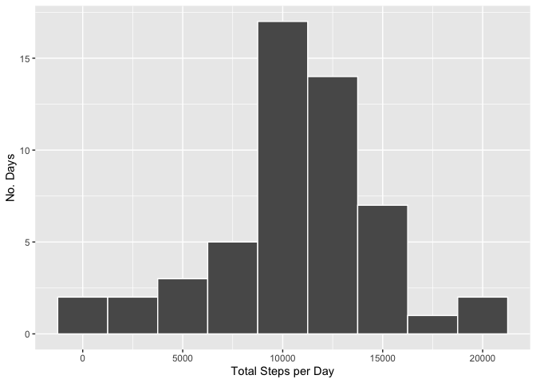
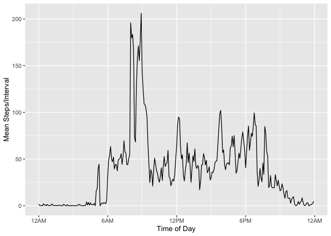
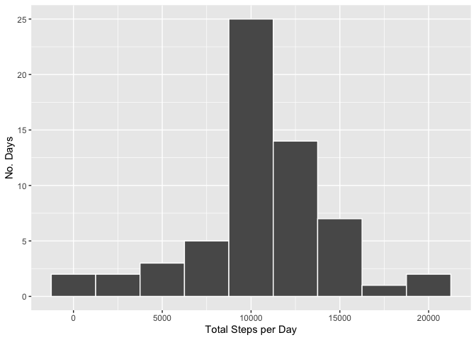
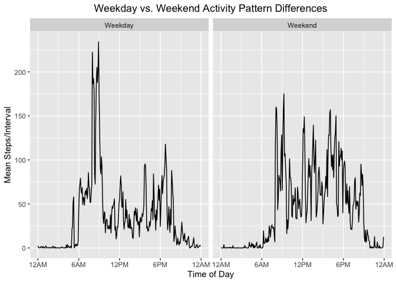

## Overview

This analysis makes use of data collected from a personal activity monitoring
device such as an [Apple](https://www.apple.com) watch. The device used in the
study collects data at 5 minute intervals throughout the day. The collected
data consists of two months of data from an anonymous individual collected
during the months of October and November 2012. It includes the number of steps
taken in 5 minute intervals each day.

This notebook makes use of the kableExtra, dplyr, and ggplot2 libraries.


```r
options(dplyr.summarise.inform = FALSE)

library(kableExtra)
library(dplyr)
library(ggplot2)
```

## Loading and preprocessing the data

The data for this analysis can be downloaded from
[Activity monitoring data](https://d396qusza40orc.cloudfront.net/repdata%2Fdata%2Factivity.zip) [52K].
The data set is stored as a compressed file (zip) that unzips to a 
comma-separated-value (CSV) file. Note that the intervals
are coded as integers, but are in HHMM format. A new column is introduced, 
called time, that re-codes interval into minutes after midnight.  Time ranges
from 0 to 1440 minutes. The date variable is converted from a character
class to a date class.


```r
if (!file.exists("activity.csv")) {
  unzip("activity.zip")
}

activity <- read.csv("activity.csv") %>%
    mutate(time=(interval%/%100)*60 + (interval%%60),
           date=as.Date(date))
```

There are a total of 17568 observations 
in this data set.

The variables included in this file are:

* **steps**: Number of steps taking in a 5-minute interval (missing
    values are coded as `NA`)

* **date**: The date on which the measurement was taken in YYYY-MM-DD
    format

* **interval**: Identifier for the 5-minute interval in which
    measurement was taken, i.e., HHMM

For the sake of convenience, the data can be found in the project repository
under the file name "activity.zip".  It was downloaded Nov. 21, 2020.
The first 10 rows are shown below.

```r
activity %>%
  head(10) %>%
  kbl() %>%
  kable_styling()
```

<table class="table" style="margin-left: auto; margin-right: auto;">
 <thead>
  <tr>
   <th style="text-align:right;"> steps </th>
   <th style="text-align:left;"> date </th>
   <th style="text-align:right;"> interval </th>
   <th style="text-align:right;"> time </th>
  </tr>
 </thead>
<tbody>
  <tr>
   <td style="text-align:right;"> NA </td>
   <td style="text-align:left;"> 2012-10-01 </td>
   <td style="text-align:right;"> 0 </td>
   <td style="text-align:right;"> 0 </td>
  </tr>
  <tr>
   <td style="text-align:right;"> NA </td>
   <td style="text-align:left;"> 2012-10-01 </td>
   <td style="text-align:right;"> 5 </td>
   <td style="text-align:right;"> 5 </td>
  </tr>
  <tr>
   <td style="text-align:right;"> NA </td>
   <td style="text-align:left;"> 2012-10-01 </td>
   <td style="text-align:right;"> 10 </td>
   <td style="text-align:right;"> 10 </td>
  </tr>
  <tr>
   <td style="text-align:right;"> NA </td>
   <td style="text-align:left;"> 2012-10-01 </td>
   <td style="text-align:right;"> 15 </td>
   <td style="text-align:right;"> 15 </td>
  </tr>
  <tr>
   <td style="text-align:right;"> NA </td>
   <td style="text-align:left;"> 2012-10-01 </td>
   <td style="text-align:right;"> 20 </td>
   <td style="text-align:right;"> 20 </td>
  </tr>
  <tr>
   <td style="text-align:right;"> NA </td>
   <td style="text-align:left;"> 2012-10-01 </td>
   <td style="text-align:right;"> 25 </td>
   <td style="text-align:right;"> 25 </td>
  </tr>
  <tr>
   <td style="text-align:right;"> NA </td>
   <td style="text-align:left;"> 2012-10-01 </td>
   <td style="text-align:right;"> 30 </td>
   <td style="text-align:right;"> 30 </td>
  </tr>
  <tr>
   <td style="text-align:right;"> NA </td>
   <td style="text-align:left;"> 2012-10-01 </td>
   <td style="text-align:right;"> 35 </td>
   <td style="text-align:right;"> 35 </td>
  </tr>
  <tr>
   <td style="text-align:right;"> NA </td>
   <td style="text-align:left;"> 2012-10-01 </td>
   <td style="text-align:right;"> 40 </td>
   <td style="text-align:right;"> 40 </td>
  </tr>
  <tr>
   <td style="text-align:right;"> NA </td>
   <td style="text-align:left;"> 2012-10-01 </td>
   <td style="text-align:right;"> 45 </td>
   <td style="text-align:right;"> 45 </td>
  </tr>
</tbody>
</table>

## What is mean total number of steps taken per day?


```r
dailyTotals <- activity %>%
  filter(!is.na(steps)) %>%
  group_by(date) %>%
  summarize(total=sum(steps)) %>%
  select(total)

dailyTotalMean <- mean(dailyTotals$total)
dailyTotalMedian <- median(dailyTotals$total)
dailyTotalMin <- min(dailyTotals$total)
dailyTotalMax <- max(dailyTotals$total)
```
From the histogram below (missing values removed), it can be seen that the subject's daily step
count ranges from just a few steps to over 20,000 (41 - 
21194).  The mean number of steps
per day is 10766 and the median is 10765.


```r
dailyTotals %>%
  ggplot(aes(x=total)) + 
  geom_histogram(binwidth=2500, colour='white') +
  xlab("Total Steps per Day") +
  ylab("No. Days")
```

<!-- -->

## What is the average daily activity pattern?

```r
intervalMeans <- activity %>%
  filter(!is.na(steps)) %>%
  group_by(time) %>%
  summarize(mean=mean(steps))

maxIntervalTime <- intervalMeans$time[which.max(intervalMeans$mean)]
maxIntervalTimeStr <- sprintf("%d:%02d", maxIntervalTime %/% 60, maxIntervalTime %% 60)
```
Below is a plot of the average daily activity pattern (missing values removed).
As expected, the number 
of steps is near zero through the night and rapidly increases with sunrise.
Activity peaks at 8:55 and rapidly diminishes thereafter. 
It remains somewhat steady after dropping off till early evening.  It
then begins slowly falling off as evening transitions to night.


```r
intervalMeans %>%
  ggplot(aes(x=time, y=mean)) +
  geom_line() +
  scale_x_continuous("Time of Day", breaks=c(0, 360, 720, 1080, 1440), 
                     labels=c("12AM", "6AM", "12PM", "6PM", "12AM")) +
  ylab("Mean Steps/Interval")
```

<!-- -->

## Imputing missing values


```r
naCount <- sum(is.na(activity$steps))
naFraction <- naCount/nrow(activity)

activityWithoutNAs <- merge(activity, intervalMeans, by="time")
activityWithoutNAs$steps[is.na(activityWithoutNAs$steps)] <- 
  activityWithoutNAs$mean[is.na(activityWithoutNAs$steps)]
```
As mentioned above, the step column has a number of NAs in it, 2304 or 
13%. I will replace the NAs with the interval
mean of the data.

```r
dailyTotals <- activityWithoutNAs %>%
  group_by(date) %>%
  summarize(total=sum(steps)) %>%
  select(total)

dailyTotalMeanWithoutNAs <- mean(dailyTotals$total)
dailyTotalMedianWithoutNAs <- median(dailyTotals$total)
dailyTotalMinWithoutNAs <- min(dailyTotals$total)
dailyTotalMaxWithoutNAs <- max(dailyTotals$total)
```
The histogram below is plotted with the missing values replaced with the
interval mean. One sees an marked increase in the number of days with around 
10,000 steps. Other bins see little change.
The daily step range is unchanged and remains at 41--21194
The mean number of steps per day is, as expected, unchanged.
There is a slight change in the median from 10765 without 
imputation to 10766.

```r
dailyTotals %>%
  ggplot(aes(x=total)) + 
  geom_histogram(binwidth=2500, colour='white') +
  xlab("Total Steps per Day") +
  ylab("No. Days")
```

<!-- -->

## Are there differences in activity patterns between weekdays and weekends?

As can be seen in the plot below, there are significant differences in activity
levels on weekdays versus weekends. In general, peak activity level occurs on
weekday mornings. Conversely, steady state activity is generally higher on
weekends than on weekdays.

```r
weekdayVersusWeekendIntervalMeans <- activity %>%
  filter(!is.na(steps)) %>%
  mutate(dayCategory=ifelse(weekdays(date) %in% c("Monday", "Tuesday", "Wednesday", "Thursday","Friday"), "Weekday", "Weekend")) %>%
  group_by(time, dayCategory) %>%
  summarize(mean=mean(steps))

weekdayVersusWeekendIntervalMeans %>%
  ggplot(aes(x=time, y=mean)) +
  geom_line() +
  scale_x_continuous("Time of Day", breaks=c(0, 360, 720, 1080, 1440), 
                     labels=c("12AM", "6AM", "12PM", "6PM", "12AM")) +
  ggtitle("Weekday vs. Weekend Activity Pattern Differences") +
  theme(plot.title = element_text(hjust = 0.5)) +
  ylab("Mean Steps/Interval") +
  facet_wrap(~ dayCategory)
```

<!-- -->

